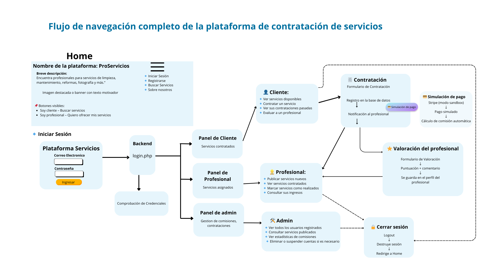
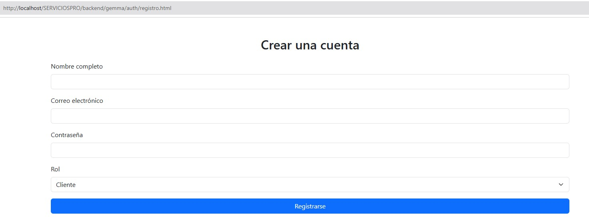
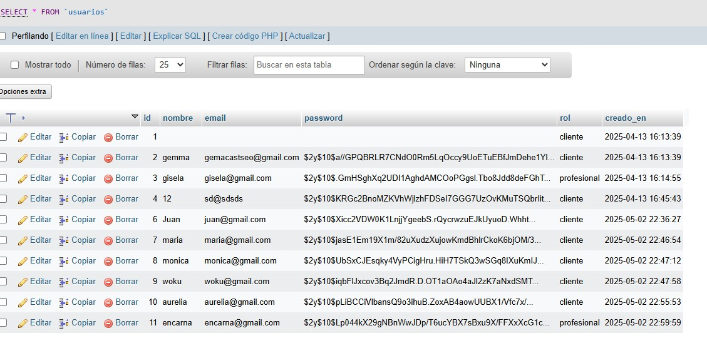

# 🏗️ Backend - Plataforma de Contratación de Servicios

Este backend forma parte del proyecto de DAW que consiste en el desarrollo de una plataforma web para la contratación de servicios diversos (limpieza, mantenimiento, fotografía, etc.), orientado tanto a personas físicas como a empresas.

## 🎯 Objetivo

Crear un sistema funcional que permita:

- Registrar usuarios (clientes, profesionales y administradores)
- Asociar servicios ofrecidos por los profesionales
- Gestionar contrataciones entre usuarios
- Aplicar comisiones automáticas
- Preparar la base para un sistema de pagos simulados o reales

## 🗄️ Estructura de la base de datos

La base de datos se llama `servicios_pro` y contiene las siguientes tablas:

### 🔹 `usuarios`

Contiene los datos de todas las personas registradas en la plataforma.

| Campo          | Tipo         | Descripción                         |
|----------------|--------------|-------------------------------------|
| id             | INT, PK      | Identificador único                 |
| nombre         | VARCHAR(100) | Nombre del usuario                  |
| email          | VARCHAR(100) | Correo electrónico (único)          |
| password       | VARCHAR(255) | Contraseña encriptada               |
| rol            | ENUM         | cliente, profesional, admin         |
| tipo_cliente   | ENUM         | persona_fisica, empresa             |
| creado_en      | TIMESTAMP    | Fecha de alta del usuario           |

---

### 🔹 `servicios`

Cada servicio está asociado a un profesional.

| Campo           | Tipo          | Descripción                              |
|------------------|---------------|------------------------------------------|
| id               | INT, PK       | Identificador único del servicio         |
| nombre           | VARCHAR(100)  | Nombre del servicio                      |
| descripcion      | TEXT          | Descripción detallada                    |
| precio           | DECIMAL(10,2) | Precio base del servicio                 |
| profesional_id   | INT, FK       | ID del profesional que lo ofrece         |
| creado_en        | TIMESTAMP     | Fecha de publicación del servicio        |

---
### 🔹 `contrataciones`

Registra las contrataciones entre clientes y servicios, incluyendo comisiones y evaluación.

| Campo               | Tipo          | Descripción                                            |
|--------------------|---------------|--------------------------------------------------------|
| id                 | INT, PK       | Identificador único de la contratación                |
| cliente_id         | INT, FK       | ID del cliente que contrata el servicio               |
| servicio_id        | INT, FK       | ID del servicio contratado                            |
| fecha              | DATETIME      | Fecha y hora de la contratación                       |
| estado             | ENUM          | pendiente, en_proceso, completado                     |
| comision           | DECIMAL(10,2) | Comisión aplicada automáticamente (ej: 10%)           |
| precio_total       | DECIMAL(10,2) | Precio total del servicio contratado                  |
| evaluacion_cliente | TEXT          | Comentarios o evaluación del cliente tras el servicio |

---

## 🔗 Diagrama  relacional




---

## 📁 Estructura del proyecto

El backend está organizado en carpetas según su funcionalidad:

- `auth/`: autenticación (`registro.php`, `login.php`, etc.)
- `db/`: conexión y scripts SQL (`conexion.php`, `crear_tablas.sql`)
- `paneles/`: vistas separadas por tipo de usuario
- `ImagenesReadme/`: recursos visuales para la documentación

---

## 🔐 Registro de usuarios

### 📄 `registro.php`

- Recibe datos del formulario mediante `POST`
- Valida campos requeridos (`nombre`, `email`, `password`)
- Encripta la contraseña con `password_hash()`
- Inserta al nuevo usuario en la tabla `usuarios`

📂 Ruta: `backend/auth/registro.php`

---

### 🧪 Formulario de prueba

Se diseñó un formulario HTML simple para probar el registro:

📂 Ruta: `backend/auth/formulario_registro.html`  
🌐 Acceso: `http://localhost/serviciospro/backend/auth/formulario_registro.html`



---

### 📋 Verificación en phpMyAdmin

- Se verificó que los datos se insertan correctamente.
- El campo `creado_en` se rellena automáticamente con `CURRENT_TIMESTAMP`.



---

## 🔑 Inicio de sesión

### 📄 `login.php`

- Valida las credenciales enviadas mediante `POST`
- Verifica el email y la contraseña con `password_verify()`
- Si son correctos:
  - Inicia sesión con `session_start()`
  - Guarda en `$_SESSION` el `id`, `nombre` y `rol` del usuario

📂 Ruta: `backend/auth/login.php`

---

### 🧪 Formulario de prueba

📂 Ruta: `backend/auth/formulario_login.html`  
🌐 Acceso: `http://localhost/serviciospro/backend/auth/formulario_login.html`

  
  


---

## 🔄 Redirección según rol

El archivo login.php realiza la autenticación de usuarios utilizando PDO y redirige automáticamente al panel correspondiente según el rol del usuario.

### ✅ Proceso paso a paso:
1. Recibe los datos enviados por POST desde el formulario de inicio de sesión.

2. Valida que el email y la contraseña no estén vacíos.

3. Realiza una consulta segura con PDO para buscar al usuario en la base de datos usuarios.

4. Si existe el usuario y la contraseña es correcta (password_verify()):

    - Se inicia la sesión con session_start().

    - Se guardan los datos en $_SESSION (usuario_id, nombre, rol).

    - Se redirige automáticamente según el rol:

        - *cliente* → privado_usuario.html

        - *profesional* → privado_empresa.html

        - *admin* → admin.php

5. Si los datos no son válidos, se muestra un mensaje de error.

#### 🧾 Fragmento de código relevante
```php
if ($usuario && password_verify($password, $usuario['password'])) {
    $_SESSION['usuario_id'] = $usuario['id'];
    $_SESSION['nombre'] = $usuario['nombre'];
    $_SESSION['rol'] = $usuario['rol'];

    // Redirección según el rol
    if ($usuario['rol'] === 'cliente') {
        header("Location: privado_usuario.html");
    } elseif ($usuario['rol'] === 'profesional') {
        header("Location: privado_empresa.html");
    } elseif ($usuario['rol'] === 'admin') {
        header("Location: admin.php");
    } else {
        echo "Rol no reconocido.";
    }
    exit();
}
```

📁 Ubicación del archivo:backend/auth/gemma/login.php
---
## 🧼 Recuperación del backend

Este backend fue restaurado tras un `push --force` que reescribió el historial.  
Se utilizó `git rebase` para resolver los conflictos y mantener toda la funcionalidad sin perder archivos.

---
## ✅ Estado actual

- Registro de usuarios: ✅  
- Inicio de sesión con sesión: ✅  
- Redirección automática por rol: ✅  
- Estructura de base de datos funcional: ✅  
- CRUD de servicios y contrataciones: ⬜ *(pendiente)*  
- Integración de pasarela de pagos: ⬜ *(planificada)*  
- Protección de rutas privadas: ⬜ *(en desarrollo)*

## 🧑‍💻 Autora del backend

**Gemma Castells Arbolí**  
Proyecto final del módulo de DAW (Desarrollo de Aplicaciones Web)  
Curso 2024-2025


